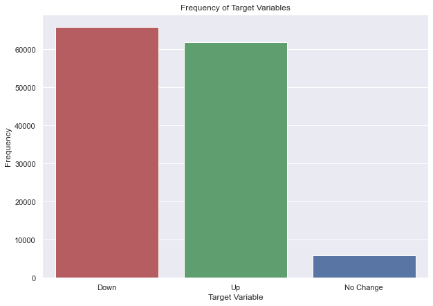
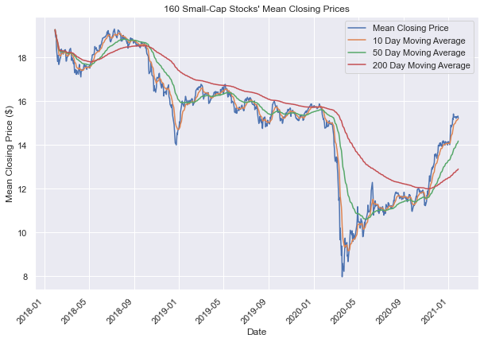

# Small-Cap Stock Price Prediction

**Author**: Jake Oddi

## Repository Structure

```
├── README.md                                            <- The top-level README for reviewers of this project
├── master_notebook.ipynb                                <- Narrative documentation of analysis in Jupyter notebook
├── presentation.pdf                                     <- PDF version of project presentation
├── price_forecasting_code                               <- Module containing cleaning, engineering, and modeling functions
    └── functions.py                                     <- .py file containing all functions
├── data                                                 <- source data used for analysis
└── images                                               <- saved graphs
``` 

## Business Problem

Quantitative analysis of stocks has become increasingly popular over the past decades, to the point where it is ubiqiutous among insitutional investors. Among individual investors, however, it is less widespread. This is due to a general lack of the technical skills required to perform such analysis. I ran into this issue myself when constructing my portfolio. I predict an easy-to-use, open-source model would serve to benefit this population. 

This project applies classification methods to the daily price data of stocks with market capitalizations between $75M and \$1B from the past three years to predict intraday price movements. Instances where the closing price exceeds the opening price are considered positive cases, and instances where the opposite is true are considered negative. The timescale for this data (daily) meant predicting the position of closing price relative to opening price was a desirable classification problem, as it is harder to do with time series modeling. Conversely, time series modeling to predict exact price is much better suited to interday prices, which is what I use it for. 

My analysis focuses on small-cap companies because they typically see lower trading volumes, and therefore have more inefficiencies that can be exploited and less noisey trading prices. Conversely, this makes trades harder to execute at desirable prices. 

Predictions of price-movement direction and price-target are nowhere near perfect, and should only be used in conjunction with additional information. In general, quantitative analysis should be combined with fundamental analysis.

To use the following project for one's own analysis, one must first create a TD Ameritrade Developer account, create an app, and fetch his or her API key, replacing mine in the form of the 'consumer_key' variable. Next, under the 'Selection' section, one should change the 'ticker_list' variable to include whichever tickers are to be included in his or her model. This will allow one to run the rest of the code and yield the same analysis as is already shown.

## Data Understanding

To decide which companies to model, I employed a stock screener from [TD Ameritrade](https://research.tdameritrade.com/grid/public/screener/stocks/overview.asp) to select stocks with market caps within my desired range. This yielded 8027 results. I filtered this down to 3055 results by removing companies worth less than \\$75M, as many companies below that threshold had such low trading volumnes that they were not conducive to modeling. For the sake of ease-of-use and proof-of-concept, I filtered this down further by randomly sampling 500. I then gathered daily price data from the past three years using [TD Ameritrade's Price History API](https://developer.tdameritrade.com/price-history/apis). Of these 500, the API failed for 157, leaving 343. Of the remaining, I selected only those with 755 days of data to use in my analysis, leaving me with 160 stocks. 

### Selecting a Sample

Due to time constraints, I wanted to select a subset of stocks on which to perform my analysis. I've chosen to use capital markets stocks, as their prices are affected the least by external influences. For example, biotechnology companies' prices are heavily influenced by their bringing new treatments and technologies to market. Capital markets companies performances are the most dependant on overall stock market performance out of all the industries in the dataset. 

## Data Cleaning

The data arrives quite clean. The only changes to be made are to the datetimes, which arrive in the unix format and need to be converted to a regular datetime, then set as the index.

### A First Look


As shown in the plot above, the average closing price of small cap stocks has been in a downward trend since year-end 2017, falling sharply around March 2020 due to the Coronavirus pandemic and its economic impact, failing to fully recover by December 2020. The trend is much more negative than the overall market, which rose consistently until March 2020, where it fell but proceeded to exceed pre-Covid levels by 
December 2020.

Next I wanted to test my hypothesis of capital markets stocks closely following the market. Below shows the mean daily closing prices of all 160 stocks, the eight capital markets stocks, and the 152 stocks that don't belong to the capital markets industry. Because the 160 is largely composed of the 152 other stocks, it's not surprising that the green line representing the other stocks so closely follows the overall trend that it obscures the blue line.


## Feature Engineering

The first feature I engineered was my target variable. The target signifies whether a stock's closing price for one day exceeds its opening price. If this is the case, the target variable = 1. If the opposite is true, wherein the stock closes lower than it opened, the target variable = 0. If the closing and opening prices are exactly the same, the target variable = 2.



As shown in the barplot above, there are relatively equivalent amounts of positive and negative cases, but high imbalance when compared to the neither case. As a result, I will use F1-Score as my evaluation metric.

Unlike for classification, the target variable for my time series analysis does not need to be engineered. It is simply the closing price of each day I want to forecast into the future.

#### Moving Averages

I know that moving averages are important technical indicators for price movement, as prices tend to revert to their means, so the next features I created served to account for both long and short-term moving averages. I created features for a 10, 50, and 200 day moving average.



The various moving averages are shown in comparison to the mean closing prices for each day. As one would expect, the 200 day average is much less affected by small price movements, as opposed to the 10 day average, which follows the mean closing price very closely.


## Modeling and Results

### Initial Classification Model

My first simple model was a KNN and was used to evaluate my engineered features. My initial accuracy and precision scores were .451 and .448, respectively; however, the addition of my moving average and percent-price-change features saw these increase to .486 and .481, respectively.

### Final Classification Models

#### Analysis of Results and Comparing Models

For my final Random Forest and KNN models, I used the parameters I obtained through my gridsearch. I anticipated that there would not be a clear favorite among the two models, and that instead KNN would perform better on some stocks while Random Forest would perform better on others. I evaluated both models on the first ten stocks, creating a list of tuples of F1-Scores. The first item in each tuple corresponds to the Random Forest F1 and the second to the KNN F1.


Contrary to my initial assumption, the KNN F1-Score (.48) outperformed the RF F1-Score (.43) by .05 on average, as shown in the graph above.

### Time Series Modeling

#### SARIMAX

In order to predict exact prices as opposed to price movements, I needed to use time series models like ARMA, which stands for Autoregressive Moving Average. The autoregressive portion of the title refers to the model's ability to predict a value based on values that came chronologically before it. The moving average portion is self explanatory, referring to the model's use of a moving average component in its forecasting. I use three variations of the ARMA model - ARMA, SARIMA, and SARIMAX.

The next logical progression after the ARMA model was the SARIMA, which stands for Seasonal Autoregressive Integrated Moving Average. As opposed to removing trend and periodicity manually through differencing and similar strategies, the model removes these elements by itself.

After detrending with SARIMA, I finally add exogenous regressors, which are additional features in addition to the time series element (the endogenous regressor). I use only the 10, 50, and 200 day moving averages, as these are the only additional features that add information.

#### LSTM RNN

Next I wanted to try a neural network. A vanilla recurrent neural network is not optimal for this application as it is unable to retain substantial information from early in the time series. As a result, I use layers made up of Long-Short Term Memory cells, as they have less information loss due to the configuration of their cells. Each cell has three activation functions, each controlling a different aspect of the cell's memory, whereas traditional RNN cells only have one.

In testing different model hyperparameter and architecture configurations, I split my experimental data into a training and a test set. The test set contains data from the most recent 14 days. The training set is split into numerous input and output sets, which together form a 3D tensor to be fed into the first LSTM layer. The splitting follows this format: given a sequence [1, 2, 3, 4, 5, 6, 7], the split sequence is: <br>

<p align="center">
  
</p>
In practice, I used an inpute sequence of length 100 and an output sequence of length 14. In tuning hyperparameters, I consult the model's bias/variance as shown by the relationship between the training and testing RMSE. 

In training each model, I used the Adaptive Moment Estimation (Adam) optimizer, as it is generally faster than the main alternative, Stochastic Gradient Descent. For my loss function I used Mean Squared Error becuase it is most closely related to my evalutation metric Root Mean Squared Error.

Through a series of steps of tuning my hyperparameters and architecture, I arrived at a final model. Its architecture is graphed below. 

<p align="center">
  
</p>

## Conclusion and Next Steps

The highest performing classification model was the KNN, though this is only on a sample of 8 out of 160. I'd like to predict on the entire set of 160, add additional models, and add an ensemble voting classifier.

For the sample I employed an ARMA model on, the average RMSE accross the 14 days was 0.287. For the sample I employed a SARIMA model on, the average RMSE accross the 14 days was 0.297. For the sample I employed a SARIMAX model on, the average RMSE accross the 14 days was 0.196 - my highest performing model. 

Although my LSTM neural net performed better on the testing dataframe in comparison to the untuned SARIMAX (RMSE of 0.495 vs. 0.634, respectively), the neural net performed worse when RMSE was averaged accross all stocks in the sample, with an RMSE of 0.763, than did the gridsearched SARIMAX (0.196).

To further improve the models I have, I'd like to add more features, such as momentum indicators like Moving Average Convergence/Divergence (MACD) and Relative Strength Index (RSI), as well as a volatility indicator like Standard Deviation or Beta. I'd also like to add a sentiment indicator based on call/put options trading.

Experimenting with different combinations of the number of input and output days is an important next step. My neural net performed poorly relative to my SARIMAX, however, perhaps it would perform comparably, if not better, if only predicting one time step as opposed to 14. 

## More Information

Please review my full analysis in the [Jupyter Notebook](./master_notebook.ipynb).

For additional info, contact Jake Oddi at [jakeoddi@gmail.com](mailto:jakeoddi@gmail.com)
